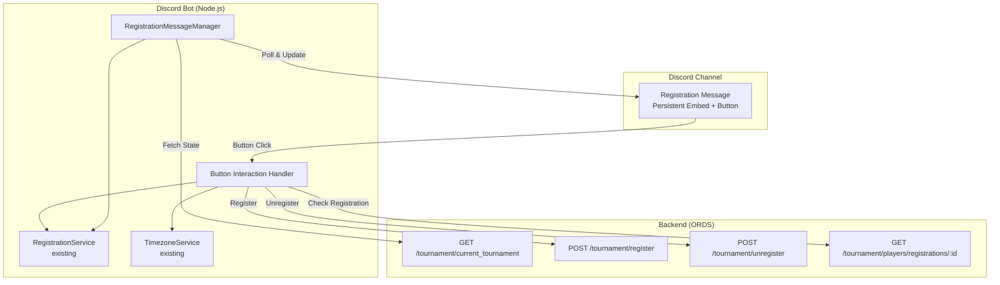
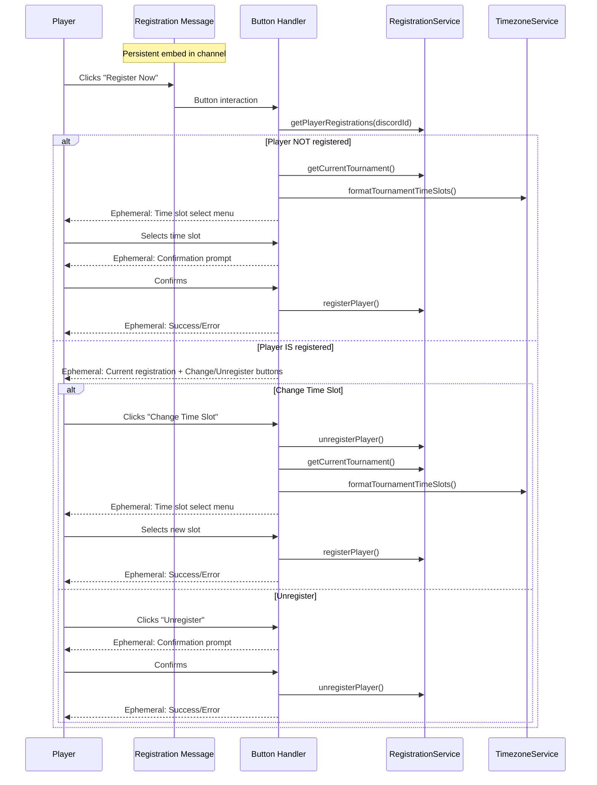

# Design Document

## Overview

This feature adds a persistent, auto-updating Discord embed message with a "Register Now" button to a designated channel. The message serves as the primary entry point for tournament registration, replacing the need for players to discover slash commands. The system reuses the existing `RegistrationService`, `TimezoneService`, and ORDS REST endpoints — no backend changes are required.

The core addition is a `RegistrationMessageManager` service that:
1. Posts and maintains a persistent embed message in a configured channel
2. Polls the backend API to detect tournament state changes and updates the embed accordingly
3. Handles button interactions with ephemeral flows for registration, time slot changes, and unregistration
4. Persists the message reference (channel ID + message ID) to a local JSON file so it survives bot restarts

### Key Design Decisions

- **Polling over WebSocket push**: The backend is Oracle ORDS with no push capability. Polling at a configurable interval (default 60s) is the pragmatic choice.
- **Local file persistence**: The message reference is stored in a simple JSON file (`data/registration-message.json`) rather than adding a database table, keeping the change self-contained in the bot.
- **Ephemeral interactions**: All button responses are ephemeral (visible only to the clicking user) to keep the channel clean.
- **Reuse existing services**: `RegistrationService` and `TimezoneService` are used as-is. No new ORDS endpoints are needed — the existing `/tournament/current_tournament` endpoint already returns `registration_open`, `close_registration_on`, and `session_date` which are sufficient to derive tournament state.

## Architecture



### Interaction Flow



## Components and Interfaces

### 1. RegistrationMessageManager (New Service)

Manages the lifecycle of the persistent registration message: posting, updating, and recovering after restarts.

```javascript
class RegistrationMessageManager {
  constructor(client, registrationService) {}
  
  // Initialize: load persisted reference, verify message exists, start polling
  async initialize() {}
  
  // Post or recover the registration message in the configured channel
  async ensureMessageExists() {}
  
  // Build the embed and button based on current tournament state
  buildRegistrationMessage(tournamentData) {}
  
  // Determine tournament state from API data
  // Uses play window (first slot → last slot + 4hrs) for 'ongoing' detection
  deriveTournamentState(tournamentData) {}
  // Returns: 'registration_open' | 'ongoing' | 'closed'
  
  // Poll loop: fetch tournament data, update embed if changed
  startPolling() {}
  stopPolling() {}
  
  // Calculate polling window based on time slots and session date
  // Returns { start: Date, end: Date } or null if no active session
  calculatePollingWindow(tournamentData) {}
  
  // Check if current time is within the polling window
  isWithinPollingWindow(tournamentData) {}
  
  // Calculate tournament play window (first slot → last slot + 4hrs)
  calculatePlayWindow(tournamentData) {}
  
  // Update the existing message with new embed content
  async updateMessage(tournamentData) {}
  
  // Persist message reference to local JSON file
  async saveMessageReference(channelId, messageId) {}
  async loadMessageReference() {}
}
```

### 2. RegistrationButtonHandler (New Module)

Handles all button and component interactions originating from the registration message.

```javascript
class RegistrationButtonHandler {
  constructor(registrationService, timezoneService) {}
  
  // Main entry point: route button click based on player state
  async handleRegisterButton(interaction) {}
  
  // Flow for unregistered players: show time slots → confirm → register
  async handleNewRegistration(interaction, tournamentData) {}
  
  // Flow for registered players: show current reg + Change/Unregister options
  async handleExistingRegistration(interaction, registrationData, tournamentData) {}
  
  // Handle time slot change: unregister → show slots → register new
  async handleTimeSlotChange(interaction, currentRegistration, tournamentData) {}
  
  // Handle unregistration: confirm → unregister
  async handleUnregister(interaction, currentRegistration) {}
  
  // Handle click when tournament is ongoing
  async handleOngoingTournament(interaction, tournamentData) {}
}
```

### 3. Setup Command (New Slash Command)

A one-time admin command to post the registration message in a channel.

```javascript
// /setup-wmgt-registration command
// Restricted to users with Manage Messages permission
export default {
  data: new SlashCommandBuilder()
    .setName('setup-wmgt-registration')
    .setDescription('Post the persistent registration message in this channel')
    .setDefaultMemberPermissions(PermissionFlagsBits.ManageMessages),
  
  async execute(interaction) {}
}
```

### 4. Integration with Existing Bot (index.js modifications)

- Import and instantiate `RegistrationMessageManager`
- Call `manager.initialize()` in the bot's `clientReady` event
- Add a new `interactionCreate` listener that routes button interactions with custom IDs prefixed `reg_` to `RegistrationButtonHandler`
- Call `manager.stopPolling()` in the bot's `stop()` method

## Data Models

### Message Reference (Local JSON File)

Stored at `bots/data/registration-message.json`:

```json
{
  "channelId": "1234567890123456789",
  "messageId": "9876543210987654321",
  "guildId": "1111111111111111111",
  "createdAt": "2024-08-10T00:00:00Z",
  "lastUpdatedAt": "2024-08-10T12:30:00Z"
}
```

### Tournament State Derivation

The tournament state is derived from the existing `/tournament/current_tournament` API response — no new fields needed:

| Condition | State |
|-----------|-------|
| No tournament data returned (empty `{}`) | `closed` |
| `registration_open === true` and `close_registration_on` is in the future | `registration_open` |
| Current time is within the tournament play window (see below) | `ongoing` |
| `registration_open === false` and session is in the future | `closed` |

### Polling Window and Tournament Play Window

The bot does not need to poll continuously. Tournaments run on weekends, so the polling window is bounded:

- **Polling starts**: 2 hours before the first time slot in `available_time_slots` on the session date (e.g., if first slot is 22:00 with `day_offset: -1`, polling starts at 20:00 the day before session date)
- **Polling ends**: 8 hours after the last time slot, OR when the next tournament's registration opens — whichever comes first
- **Outside the polling window**: The bot polls every hour until the next weekend's registration becomes available. Once the polling window starts (2 hours before first time slot), it switches to the faster configurable interval (default 60s).

The **tournament play window** (used to derive `ongoing` state) is:
- **Starts**: At the first time slot on the session date (accounting for `day_offset`)
- **Ends**: 4 hours after the last time slot (enough time for the final group to finish playing)

This means the `ongoing` state is active from the first time slot through 4 hours after the last time slot. Outside this window but within the polling window, the state is either `registration_open` or `closed` depending on the registration dates.

### Embed Content by State

**registration_open:**
- Title: "🏆 {Tournament Name} — {Week}"
- Fields: Session date, courses, time slots list, registration close time (Discord timestamp)
- Button: "Register Now" (green, enabled)
- Color: Green (0x00AE86)

**ongoing:**
- Title: "🏆 {Week} (In Progress)"
- Fields: UTC time slot, session date as Discord timestamp (`<t:{session_date_epoch}:F>`)
- Button: "Tournament In Progress" (grey, disabled)
- Color: Orange (0xFFA500)

**closed:**
- Title: "🏆 WMGT Tournament"
- Description: "No active tournament session. Check back soon!"
- Button: "Registration Closed" (grey, disabled)
- Color: Grey (0x808080)

### Button Custom IDs

| Custom ID | Purpose |
|-----------|---------|
| `reg_register` | Main "Register Now" button on the persistent message |
| `reg_timeslot_{index}` | Time slot selection in ephemeral flow |
| `reg_confirm_{sessionId}_{timeSlot}` | Confirm registration |
| `reg_cancel` | Cancel current flow |
| `reg_change_slot` | Change time slot option for registered players |
| `reg_unregister` | Unregister option for registered players |
| `reg_confirm_unreg_{sessionId}` | Confirm unregistration |

### Configuration Additions

New entries in `bots/src/config/config.js`:

```javascript
registration: {
  pollIntervalMs: parseInt(process.env.REGISTRATION_POLL_INTERVAL) || 60000,
  idlePollIntervalMs: parseInt(process.env.REGISTRATION_IDLE_POLL_INTERVAL) || 3600000, // 1 hour outside active window
  messageDataPath: process.env.REGISTRATION_MESSAGE_DATA_PATH || './data/registration-message.json',
  channelId: process.env.REGISTRATION_CHANNEL_ID || null,
  pollingStartOffsetHrs: parseInt(process.env.REGISTRATION_POLL_START_OFFSET_HRS) || 2,  // Start active polling N hours before first time slot
  pollingEndOffsetHrs: parseInt(process.env.REGISTRATION_POLL_END_OFFSET_HRS) || 8,      // Stop active polling N hours after last time slot
  playWindowEndOffsetHrs: parseInt(process.env.REGISTRATION_PLAY_WINDOW_END_HRS) || 4    // 'ongoing' state ends N hours after last time slot
}
```


## Correctness Properties

*A property is a characteristic or behavior that should hold true across all valid executions of a system — essentially, a formal statement about what the system should do. Properties serve as the bridge between human-readable specifications and machine-verifiable correctness guarantees.*

### Property 1: Message reference persistence round trip

*For any* valid message reference object (containing channelId, messageId, guildId, and timestamps), saving it to the JSON file and then loading it back should produce an equivalent object.

**Validates: Requirements 1.2**

### Property 2: Registration-open embed completeness

*For any* tournament data where the derived state is `registration_open`, the built embed should contain the tournament name, session week, session date, at least one course, at least one time slot, and an enabled button labeled "Register Now".

**Validates: Requirements 1.4, 1.5, 2.1**

### Property 3: Ongoing embed correctness

*For any* tournament data where the derived state is `ongoing`, the built embed should contain the tournament name, session week, and a disabled button with a label indicating the tournament is in progress.

**Validates: Requirements 2.2, 5.3**

### Property 4: Closed embed correctness

*For any* empty or null tournament data (no active session), the built embed should contain a message indicating no active tournament and a disabled button.

**Validates: Requirements 2.3**

### Property 5: Tournament state derivation correctness

*For any* tournament data object with valid time slots and dates, the derived state should be exactly one of `registration_open`, `ongoing`, or `closed`, and the derivation should be consistent: if `registration_open` is true and `close_registration_on` is in the future then state is `registration_open`; if the current time falls within the play window (first time slot through last time slot + 4 hours) then state is `ongoing`; otherwise state is `closed`.

**Validates: Requirements 2.1, 2.2, 2.3**

### Property 6: Ongoing state blocks all modifications

*For any* tournament data where the derived state is `ongoing`, the button handler should reject registration, time slot change, and unregistration attempts, returning a lockout message for each.

**Validates: Requirements 5.1, 5.2**

### Property 7: Existing registration shows management options

*For any* player with an existing registration (non-empty registration data), the button handler response should include both a "Change Time Slot" and an "Unregister" option.

**Validates: Requirements 4.2**

### Property 8: Change detection triggers embed update

*For any* two distinct tournament data snapshots where at least one field differs (e.g., different time slots, different registration_open status, different courses), the manager should detect the change and produce a different embed.

**Validates: Requirements 6.2**

## Error Handling

### Button Interaction Errors

- **API unreachable on button click**: Respond with ephemeral message: "The tournament service is temporarily unavailable. Please try again in a few minutes." Do not expose internal error details.
- **Registration API error**: Display the error message from the API response (e.g., "Registration for this tournament session has closed") with a suggestion to retry.
- **Unregistration API error**: Display the error message and inform the player their current registration is unchanged.
- **Interaction timeout**: Discord automatically dismisses ephemeral interactions after 15 minutes. The component collectors use a 5-minute timeout, after which the interaction is cleaned up with a timeout message.

### Polling Errors

- **API unreachable during poll**: Log the error, retain the last known embed state, and retry on the next poll interval. Do not update the message with error content.
- **Message deleted externally**: If the message edit fails with a "Unknown Message" error, treat it as a deleted message and post a new one (same as Requirement 1.3).
- **Rate limiting**: The existing `DiscordRateLimitHandler` handles Discord API rate limits. The polling interval (60s default) is well within Discord's rate limits for message edits.

### Recovery Scenarios

| Scenario | Behavior |
|----------|----------|
| Bot restarts | Load persisted reference, verify message exists, resume polling |
| Message deleted | Detect on next edit attempt, post new message, update reference |
| Channel deleted | Log error, stop polling, require admin to run `/setup-registration` again |
| API down during poll | Keep last known state, retry next interval |
| API down on button click | Ephemeral error message to user |

## Testing Strategy

### Unit Tests (Vitest)

Focus on specific examples and edge cases:

- `RegistrationMessageManager.deriveTournamentState()`: Test with specific tournament data snapshots for each state
- `RegistrationMessageManager.buildRegistrationMessage()`: Test embed structure for each state with known inputs
- `RegistrationButtonHandler`: Test routing logic (new vs existing registration, ongoing lockout) with mocked services
- Message reference save/load with valid and invalid file states
- Edge cases: empty tournament data, missing fields, null timezone

### Property-Based Tests (fast-check + Vitest)

Use the `fast-check` library for property-based testing with Vitest. Each property test runs a minimum of 100 iterations.

- **Property 1**: Generate random message reference objects, save to temp file, load back, assert equality
  - Tag: **Feature: discord-tournament-registration, Property 1: Message reference persistence round trip**
- **Property 2**: Generate random tournament data with `registration_open` state, build embed, assert all required fields present
  - Tag: **Feature: discord-tournament-registration, Property 2: Registration-open embed completeness**
- **Property 3**: Generate random tournament data with `ongoing` state, build embed, assert disabled button and state label
  - Tag: **Feature: discord-tournament-registration, Property 3: Ongoing embed correctness**
- **Property 4**: Generate null/empty tournament data, build embed, assert closed state content
  - Tag: **Feature: discord-tournament-registration, Property 4: Closed embed correctness**
- **Property 5**: Generate random tournament data with various date/flag combinations, derive state, assert exactly one valid state and consistency with input conditions
  - Tag: **Feature: discord-tournament-registration, Property 5: Tournament state derivation correctness**
- **Property 6**: Generate random ongoing tournament data, attempt register/change/unregister actions, assert all are rejected
  - Tag: **Feature: discord-tournament-registration, Property 6: Ongoing state blocks all modifications**
- **Property 7**: Generate random non-empty registration data, build response, assert both management options present
  - Tag: **Feature: discord-tournament-registration, Property 7: Existing registration shows management options**
- **Property 8**: Generate pairs of distinct tournament data snapshots, assert change detection produces different embeds
  - Tag: **Feature: discord-tournament-registration, Property 8: Change detection triggers embed update**

### Test Data Generators (fast-check Arbitraries)

Key generators needed:
- `arbTournamentData(state)`: Generates valid tournament data for a given state (`registration_open`, `ongoing`, `closed`)
- `arbMessageReference()`: Generates valid message reference objects with Discord snowflake IDs
- `arbRegistrationData()`: Generates player registration data with session details
- `arbTimeSlot()`: Generates valid time slot strings from the known set (22:00, 00:00, 02:00, 04:00, 08:00, 12:00, 16:00, 18:00, 20:00)
