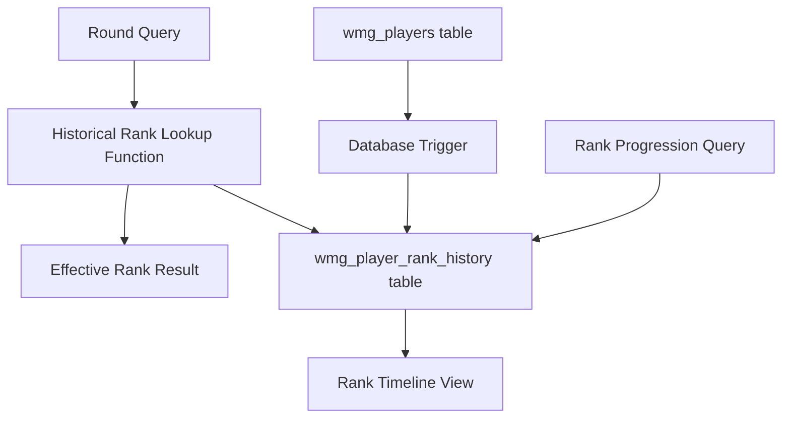

# Design Document: Player Rank History Tracking

## Overview

This design implements a comprehensive player rank history tracking system that maintains a complete timeline of rank changes while preserving the existing rank functionality. The system will automatically track all rank transitions from the initial "NEW" status to active ranks and between active ranks, enabling historical analysis and round-specific rank lookups.

The design introduces a new `wmg_player_rank_history` table to store historical rank data, database triggers for automatic tracking, and optimized queries for efficient historical rank lookups. The solution maintains backward compatibility with existing systems while adding powerful new analytical capabilities.

## Architecture

The rank history tracking system follows a trigger-based architecture that automatically captures rank changes as they occur in the existing `wmg_players` table. This approach ensures data consistency and eliminates the need for application-level changes to maintain historical data.



The architecture consists of:
- **Data Layer**: New history table with optimized indexes
- **Trigger Layer**: Automatic change detection and logging
- **Query Layer**: Efficient lookup functions and views
- **API Layer**: Functions for common rank history operations

## Components and Interfaces

### Database Schema Components

#### wmg_player_rank_history Table
```sql
create table wmg_player_rank_history (
    id                    number generated always as identity primary key
  , player_id             number not null
  , old_rank_code         varchar2(10)
  , new_rank_code         varchar2(10) not null
  , change_timestamp      timestamp with local time zone not null
  , change_reason         varchar2(500)
  , change_type           varchar2(20) not null -- 'AUTOMATIC', 'MANUAL', 'INITIAL', 'SEASON_END', 'MIDSEASON'
  , changed_by            varchar2(60) not null
  , tournament_session_id number -- references wmg_tournament_sessions.id for context
  , checkpoint_type       varchar2(20) -- 'END_SEASON', 'WEEK_6', 'WEEK_12'
  , created_on            timestamp with local time zone default current_timestamp
  , created_by            varchar2(60) default user
  , constraint wmg_player_rank_hist_fk1 foreign key (player_id) references wmg_players(id)
  , constraint wmg_player_rank_hist_fk2 foreign key (old_rank_code) references wmg_ranks(code)
  , constraint wmg_player_rank_hist_fk3 foreign key (new_rank_code) references wmg_ranks(code)
  , constraint wmg_player_rank_hist_fk4 foreign key (tournament_session_id) references wmg_tournament_sessions(id)
);
```

#### Indexes for Performance
```sql
-- Primary lookup: player + timestamp for historical queries
create index wmg_player_rank_hist_i1 on wmg_player_rank_history (player_id, change_timestamp);
```

### Trigger Components

#### Automatic Rank Change Tracking Trigger
```sql
create or replace trigger wmg_players_rank_history_trg
    before update of rank_code on wmg_players
    for each row
    when (old.rank_code != new.rank_code)
```

The trigger will:
- Detect rank_code changes in wmg_players
- Insert historical record with old and new rank
- Capture timestamp and user context
- Determine change type (automatic vs manual)
- Handle error cases gracefully

### Query Interface Components

#### Historical Rank Lookup Function
```sql
function get_player_rank_at_time(
    p_player_id in number,
    p_timestamp in timestamp with local time zone
) return varchar2
```

#### Batch Rank Lookup for Rounds
```sql
function get_rounds_with_historical_ranks(
    p_round_ids in number_array
) return rank_lookup_results_table pipelined
```

#### Rank Progression View
```sql
create or replace view wmg_player_rank_progression_v as
-- Combines current and historical rank data for complete timeline
```

### API Functions

#### Player Rank Timeline
- `get_player_rank_timeline(player_id)` - Complete rank history for a player
- `get_rank_duration_stats(player_id)` - Time spent in each rank
- `get_rank_change_summary(player_id)` - Summary statistics

#### Historical Analysis
- `get_rank_distribution_at_date(target_date)` - Rank distribution snapshot
- `get_rank_promotion_rates(date_range)` - Promotion/demotion statistics
- `get_new_player_progression(date_range)` - NEW to active rank transitions

#### Historical Data Seeding
- `seed_historical_ranks_from_session(tournament_session_id, checkpoint_type)` - Seed ranks based on tournament session performance
- `calculate_session_end_ranks(tournament_session_id)` - Calculate final ranks based on session rules
- `apply_midseason_promotions_relegations(tournament_session_id)` - Apply week 6 checkpoint changes

## Data Models

### Historical Rank Seeding Strategy

The system will implement a comprehensive historical seeding approach based on actual tournament performance from Season 16 onwards:

#### Season 16 End-of-Season Seeding
- **Baseline Establishment**: Use Season 16 final standings as the first historical rank for all participating players
- **Rank Assignment**: Apply final season rankings based on total points accumulated
- **Timestamp**: Use Season 16 tournament close date as the change timestamp
- **Change Type**: 'SEASON_END' with tournament_session_id referencing the Season 16 session and checkpoint_type 'END_SEASON'

#### Season 17 Checkpoint Seeding
- **Week 6 Checkpoint**: Apply mid-season promotions and relegations based on point thresholds
  - Elite: 45+ points remain Elite, <45 points relegated
  - Pro: 32-44 points remain Pro, <32 points relegated, >44 points promoted
  - Semi-Pro: 22-31 points remain Semi-Pro, <22 points relegated, >31 points promoted
- **End-of-Season**: Apply final rankings based on 12-week performance
  - Elite: 90+ points
  - Pro: 64-89 points  
  - Semi-Pro: 44-63 points
  - Amateur: <44 points

#### Season 18 Checkpoint Seeding
- **Week 6 Checkpoint**: Same promotion/relegation rules as Season 17
- **End-of-Season**: Same final ranking rules as Season 17

#### Automatic Promotion Rules Integration
The seeding process will also capture automatic promotions that occurred during seasons:
- **Elite**: Any Top 3 finish during the season
- **Pro**: Any Top 10 finish during the season  
- **Semi-Pro**: Any Top 25 finish during the season

### Player Rank History Record
```
PlayerRankHistory {
    id: number (Primary Key)
    player_id: number (Foreign Key to wmg_players.id)
    old_rank_code: varchar2(10) (Foreign Key to wmg_ranks.code, nullable for initial)
    new_rank_code: varchar2(10) (Foreign Key to wmg_ranks.code)
    change_timestamp: timestamp with local time zone
    change_reason: varchar2(500) (Optional description)
    change_type: enum('AUTOMATIC', 'MANUAL', 'INITIAL', 'SEASON_END', 'MIDSEASON')
    changed_by: varchar2(60) (User who made the change)
    tournament_session_id: number (Foreign Key to wmg_tournament_sessions.id)
    checkpoint_type: varchar2(20) (e.g., 'END_SEASON', 'WEEK_6', 'WEEK_12')
    created_on: timestamp with local time zone
    created_by: varchar2(60)
}
```

### Historical Rank Lookup Result
```
HistoricalRankResult {
    round_id: number
    player_id: number
    round_timestamp: timestamp with local time zone
    effective_rank_code: varchar2(10)
    rank_name: varchar2(32)
    rank_was_new: boolean (true if rank was "NEW" at time of round)
}
```

### Rank Progression Timeline
```
RankProgressionEntry {
    player_id: number
    rank_code: varchar2(10)
    rank_name: varchar2(32)
    start_date: timestamp with local time zone
    end_date: timestamp with local time zone (null for current rank)
    duration_days: number
    change_reason: varchar2(500)
    change_type: varchar2(20)
    changed_by: varchar2(60)
}
```

## Correctness Properties

*A property is a characteristic or behavior that should hold true across all valid executions of a system-essentially, a formal statement about what the system should do. Properties serve as the bridge between human-readable specifications and machine-verifiable correctness guarantees.*

### Converting EARS to Properties

Based on the prework analysis, I'll convert the testable acceptance criteria into universally quantified properties, combining related criteria to eliminate redundancy:

**Property 1: Rank Change Recording Completeness**
*For any* player rank change (from NEW to active rank or between active ranks), the system should automatically create a history record containing the old rank, new rank, timestamp, change type, and user information.
**Validates: Requirements 1.1, 1.3, 4.1, 4.2, 4.3**

**Property 2: Historical Data Preservation**
*For any* sequence of rank changes for a player, all historical records should remain intact and accessible, with each change recorded as a separate entry.
**Validates: Requirements 1.2, 1.5**

**Property 3: Temporal Rank Lookup Accuracy**
*For any* round and its timestamp, querying the player's historical rank should return the rank that was effective at the time the round was played, correctly handling NEW status and transitions between active ranks.
**Validates: Requirements 2.1, 2.2, 2.3**

**Property 4: Fallback Rank Behavior**
*For any* player with an active rank but no history records, historical rank queries should return their current rank as a fallback.
**Validates: Requirements 2.4**

**Property 5: Batch Processing Consistency**
*For any* set of rounds queried together, each round should receive the same historical rank result as if queried individually.
**Validates: Requirements 2.5**

**Property 6: Chronological Ordering**
*For any* player's rank history or progression query, results should be returned in chronological order from oldest to newest.
**Validates: Requirements 1.4, 3.2**

**Property 7: Progression Display Completeness**
*For any* player's rank progression view, it should include all required information (dates, durations, reasons, statistics) and properly exclude NEW status unless specifically requested.
**Validates: Requirements 3.1, 3.4**

**Property 8: NEW Player Display**
*For any* player who has never completed a tournament, their progression should display NEW status with their registration date.
**Validates: Requirements 3.3**

**Property 9: Audit Information Completeness**
*For any* rank change (automatic or manual), the system should capture and display complete audit information including who made the change and when.
**Validates: Requirements 3.5, 4.3, 6.2**

**Property 10: Bulk Update Tracking**
*For any* bulk rank update operation, each individual player's rank change should generate its own history record.
**Validates: Requirements 4.5**

**Property 11: Manual Change Validation**
*For any* manual rank change attempt, the system should require a reason and reject changes without proper justification.
**Validates: Requirements 6.1, 6.5**

**Property 12: Manual vs Automatic Distinction**
*For any* rank history query, manual changes should be clearly distinguishable from automatic changes in the results.
**Validates: Requirements 6.4**

**Property 13: Reason Persistence**
*For any* rank change with a provided reason, the reason should be stored and retrievable in future queries.
**Validates: Requirements 6.3**

**Property 14: Historical Distribution Accuracy**
*For any* point in time, rank distribution reports should accurately reflect how many players held each rank at that specific date.
**Validates: Requirements 7.1**

**Property 15: Trend Analysis Calculations**
*For any* date range, promotion and demotion rate calculations should accurately reflect the actual rank transitions that occurred.
**Validates: Requirements 7.2**

**Property 16: Statistical Calculations**
*For any* player's rank history, time-based statistics (duration in rank, progression velocity) should be calculated correctly based on the historical timestamps.
**Validates: Requirements 7.4**

**Property 17: Filtering Functionality**
*For any* historical distribution query with date range or tournament type filters, results should include only data matching the specified criteria.
**Validates: Requirements 7.3**

**Property 18: Historical Seeding Accuracy**
*For any* season-end or checkpoint seeding operation, the system should correctly calculate and assign ranks based on tournament performance data and established promotion/relegation rules.
**Validates: Requirements 4.6**

## Error Handling

The rank history tracking system implements comprehensive error handling to ensure data integrity and system reliability:

### Database Trigger Error Handling
- **Trigger Failure Recovery**: If the history tracking trigger fails, the original rank update continues while logging the error
- **Constraint Violation Handling**: Foreign key violations are caught and logged with detailed context
- **Transaction Isolation**: History recording failures do not rollback the primary rank update

### Query Error Handling
- **Missing Data Graceful Degradation**: Historical queries fall back to current rank when history data is unavailable
- **Invalid Parameter Handling**: Functions validate input parameters and return appropriate error codes
- **Performance Timeout Protection**: Long-running historical queries implement timeout mechanisms

### Data Consistency Safeguards
- **Orphaned Record Prevention**: Constraints ensure all history records reference valid players and ranks
- **Timestamp Validation**: Change timestamps are validated to prevent future dates or invalid sequences
- **Duplicate Prevention**: Unique constraints prevent duplicate history entries for the same change

## Testing Strategy

The testing strategy employs a dual approach combining unit tests for specific scenarios and property-based tests for comprehensive validation across all possible inputs.

### Property-Based Testing Configuration
- **Testing Framework**: Oracle PL/SQL Unit Testing Framework with custom property test harness
- **Test Iterations**: Minimum 100 iterations per property test to ensure comprehensive coverage
- **Data Generation**: Smart generators that create realistic player histories, rank changes, and temporal sequences
- **Test Tagging**: Each property test tagged with format: **Feature: player-rank-history-tracking, Property {number}: {property_text}**

### Unit Testing Focus Areas
- **Edge Cases**: NEW player scenarios, first tournament completions, boundary timestamps
- **Integration Points**: Trigger behavior, view performance, API function correctness
- **Error Conditions**: Invalid inputs, constraint violations, system failures
- **Data Migration**: Initial history creation for existing players

### Test Data Management
- **Realistic Scenarios**: Test data reflects actual tournament patterns and rank progression
- **Temporal Complexity**: Tests include overlapping tournaments, rapid rank changes, and historical edge cases
- **Scale Testing**: Large datasets to validate index performance and query optimization
- **Cleanup Procedures**: Automated test data cleanup to maintain database performance

### Performance Validation
- **Query Performance**: Historical lookup functions tested with large datasets
- **Index Effectiveness**: Verification that indexes provide expected performance improvements
- **Batch Operation Efficiency**: Bulk update and query operations tested for scalability
- **Memory Usage**: Monitoring of memory consumption during large historical queries

The testing strategy ensures that all correctness properties are validated while maintaining system performance and reliability under realistic usage patterns.