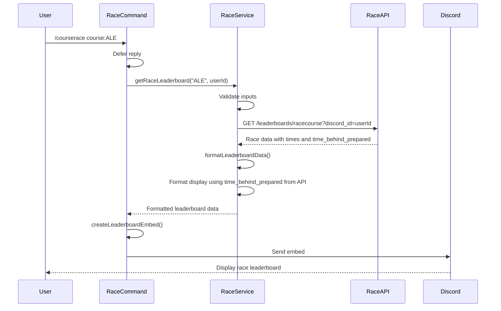
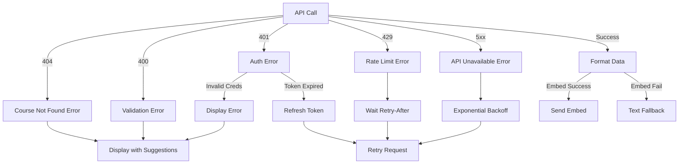

# Design Document: Race Leaderboard Command

## Overview

This design document describes the implementation of a new `/courserace` Discord bot command that displays race speedrun leaderboards for Walkabout Mini Golf courses. The implementation will maximize code reuse from the existing `/course` command by:

1. **Reusing the entire command structure** from `course.js` with minimal modifications
2. **Creating a new service** `RaceLeaderboardService.js` that extends the existing `CourseLeaderboardService.js`
3. **Overriding only race-specific methods** (API endpoint, data formatting with time_behind_prepared)
4. **Inheriting all authentication, error handling, and caching logic** from the parent service
5. **No new error handling** - all error scenarios are already handled by the mature, stable parent service

This approach ensures consistency, reduces code duplication, and maintains the same security and reliability patterns already proven in the `/course` command. The API provides `time_behind_prepared` as a ready-to-print value, eliminating the need for time delta calculations.

## Architecture

### Component Diagram

```mermaid
graph TB
    User[Discord User] -->|/race command| RaceCommand[race.js]
    RaceCommand -->|uses| RaceService[RaceLeaderboardService]
    RaceService -->|extends| CourseService[CourseLeaderboardService]
    CourseService -->|extends| BaseAuth[BaseAuthenticatedService]
    
    RaceService -->|calls| RaceAPI[/leaderboards/racecourse]
    RaceService -->|inherits| TokenMgr[TokenManager]
    RaceService -->|inherits| RetryHandler[RetryHandler]
    RaceService -->|inherits| Logger[Logger]
    
    RaceCommand -->|creates| Embed[Discord Embed]
    RaceCommand -->|fallback| TextDisplay[Text Display]
```

### Key Design Decisions

1. **Inheritance over Duplication**: `RaceLeaderboardService` extends `CourseLeaderboardService` to inherit all common functionality
2. **Method Overriding**: Only override methods that differ for race leaderboards (API endpoint, data formatting)
3. **Command Reuse**: Copy `course.js` to `race.js` and modify only the service instantiation and display labels
4. **Shared Utilities**: Reuse all existing utilities (Logger, ErrorHandler, RetryHandler, TokenManager)

## Components and Interfaces

### 1. Race Command Handler (`bots/src/commands/courserace.js`)

**Purpose**: Handle Discord `/courserace` slash command interactions

**Implementation Strategy**: 
- Copy `course.js` to `courserace.js`
- Replace `CourseLeaderboardService` with `RaceLeaderboardService`
- Update display strings ("Course Leaderboard" → "Race Leaderboard", "Top Scores" → "Top Race Times")
- Keep all error handling, autocomplete, and interaction logic identical (no new error handling needed)

**Key Methods**:
- `execute(interaction)`: Main command handler (reused from course.js)
- `autocomplete(interaction)`: Course autocomplete (reused from course.js)

### 2. Race Leaderboard Service (`bots/src/services/RaceLeaderboardService.js`)

**Purpose**: Fetch and format race leaderboard data from the API

**Implementation Strategy**:
- Extend `CourseLeaderboardService` to inherit all authentication, caching, and error handling
- Override only the methods that differ for race leaderboards
- Reuse all other methods unchanged

**Class Structure**:

```javascript
export class RaceLeaderboardService extends CourseLeaderboardService {
  constructor() {
    super('RaceLeaderboardService');
  }

  // OVERRIDE: Use race API endpoint instead of course endpoint
  async getRaceLeaderboard(courseCode, userId) { ... }

  // OVERRIDE: Format race data (times instead of scores)
  formatLeaderboardData(apiResponse, userId) { ... }

  // OVERRIDE: Format leaderboard lines with time deltas
  formatLeaderboardLines(leaderboardData) { ... }

  // OVERRIDE: Create embed with "Race Leaderboard" title
  createLeaderboardEmbed(leaderboardData, courseInfo) { ... }

  // OVERRIDE: Create text display with race-specific formatting
  createTextDisplay(leaderboardData, courseInfo) { ... }

  // INHERITED: All authentication methods from CourseLeaderboardService
  // INHERITED: All error handling methods from CourseLeaderboardService
  // INHERITED: All course caching methods from CourseLeaderboardService
  // INHERITED: All autocomplete methods from CourseLeaderboardService
}
```

**Methods to Override**:

1. **getRaceLeaderboard(courseCode, userId)**
   - Similar to `getCourseLeaderboard()` but uses `/leaderboards/racecourse` endpoint
   - Returns race data with `round_speed_prepared` and `time_behind_prepared` fields
   - Inherits all retry logic, authentication, and error handling (no new error handling needed)

2. **formatLeaderboardData(apiResponse, userId)**
   - Similar to parent method but processes `round_speed_prepared` and `time_behind_prepared` instead of `score`
   - No time delta calculations needed - API provides `time_behind_prepared` ready to print
   - Returns formatted data structure compatible with display methods

3. **formatLeaderboardLines(leaderboardData)**
   - Similar to parent method but displays times instead of scores
   - Uses `time_behind_prepared` from API for positions 2+
   - Format: `🥇 3:35.92 PuttNaked` (1st place)
   - Format: `🥈 3:38.73 El Jorge (+2.81)` (2nd+ place, using time_behind_prepared)

4. **createLeaderboardEmbed(leaderboardData, courseInfo)**
   - Minimal override: change title to "Race Leaderboard" and field name to "Top Race Times"
   - Reuse all other embed logic from parent

5. **createTextDisplay(leaderboardData, courseInfo)**
   - Minimal override: change header to "Race Leaderboard"
   - Reuse all other text display logic from parent

**Methods Inherited (No Changes)**:
- `getAuthToken()` - OAuth2 authentication
- `refreshTokenIfNeeded()` - Token refresh logic
- `getAvailableCourses()` - Course list for autocomplete
- `getFallbackCourses()` - Fallback course data
- `getSuggestedCourses()` - Course suggestions
- `clearCourseCache()` - Cache management
- `getCourseNameFromCode()` - Course name lookup
- `getCourseDifficulty()` - Difficulty determination
- `truncateTextDisplay()` - Text truncation
- All error handling methods (createCourseNotFoundError, createApiUnavailableError, etc.)

### 3. Data Models

#### Race Leaderboard Entry

```javascript
{
  position: number,           // Leaderboard position (1, 2, 3, ...)
  playerName: string,         // Player display name
  roundSpeedPrepared: string, // Formatted time string (e.g., "3:35.92")
  timeBehindPrepared: string | null, // Pre-formatted time behind (e.g., "2.81") - null for 1st place
  discordId: string | null,   // Discord user ID (if available)
  isApproved: boolean,        // Whether score is approved
  isCurrentUser: boolean      // Whether this is the current user's entry
}
```

#### Race Leaderboard Data

```javascript
{
  course: {
    code: string,             // Course code (e.g., "ALE")
    name: string,             // Course name (e.g., "Alfheim")
    difficulty: string        // Difficulty indicator (e.g., "(Easy)")
  },
  entries: Array<RaceLeaderboardEntry>,
  totalEntries: number,
  userEntries: Array<RaceLeaderboardEntry>,
  hasUserScores: boolean,
  lastUpdated: Date
}
```

#### API Response Structure

```javascript
{
  items: [
    {
      pos: number,                    // Position in leaderboard
      player_name: string,            // Player name
      round_speed_prepared: string,   // Pre-formatted time (e.g., "3:35.92")
      time_behind_prepared: string | null, // Pre-formatted time behind (e.g., "2.81") - null for 1st place
      discord_id: string | null,      // Discord user ID
      isapproved: string              // "true" or "false"
    }
  ],
  hasMore: boolean,
  count: number
}
```

## Data Flow

### Command Execution Flow



### Time Behind Display

No calculations needed - the API provides `time_behind_prepared` ready to print:

For each entry at position N:
- Position 1: Display only `round_speed_prepared` (e.g., "3:35.92")
- Position 2+: Display `round_speed_prepared` followed by `(+{time_behind_prepared})` (e.g., "3:38.73 (+2.81)")

Example:
- Position 1: 3:35.92 → No time behind
- Position 2: 3:38.73 → time_behind_prepared = "2.81" → Display: "3:38.73 (+2.81)"
- Position 3: 3:53.92 → time_behind_prepared = "15.19" → Display: "3:53.92 (+15.19)"

## Correctness Properties

*A property is a characteristic or behavior that should hold true across all valid executions of a system—essentially, a formal statement about what the system should do. Properties serve as the bridge between human-readable specifications and machine-verifiable correctness guarantees.*

### Property 1: Time Behind Display Formatting

*For any* race leaderboard entry at position P where P > 1 and time_behind_prepared is not null, the displayed time should include the time_behind_prepared value formatted as "(+{time_behind_prepared})".

**Validates: Requirements 4.3, 4.4**

### Property 2: First Place Has No Time Behind

*For any* race leaderboard, the entry at position 1 should have a null time_behind_prepared value and no time behind display in the formatted output.

**Validates: Requirements 4.2**

### Property 3: Time Format Preservation

*For any* race leaderboard entry, the displayed time should exactly match the round_speed_prepared value from the API, preserving the MM:SS.ms format and precision.

**Validates: Requirements 4.1, 4.5**

### Property 4: Medal Indicators and Position Display

*For any* race leaderboard, positions 1, 2, and 3 should display 🥇, 🥈, and 🥉 respectively with bolded player names, and positions 4 and above should display numeric position indicators with non-bolded names.

**Validates: Requirements 5.1, 5.2, 5.3, 5.4, 5.5, 5.6**

### Property 5: Player Name Truncation

*For any* player name longer than 25 characters, the displayed name should be truncated to 22 characters followed by "..." (total 25 characters).

**Validates: Requirements 5.7**

### Property 6: User Score Highlighting

*For any* race leaderboard and any user, all entries where discord_id matches the user's ID should be marked as isCurrentUser, display the user highlighting indicator (⬅️), and if not approved, also display the approval status indicator (📝).

**Validates: Requirements 6.1, 6.2, 6.3**

### Property 7: User Score Summary Section

*For any* race leaderboard where the user has one or more scores, a "Your Time" section should be created listing all user entries with their positions, times, and approval status (approved or personal).

**Validates: Requirements 6.4, 6.5**

### Property 8: API Response Validation and Filtering

*For any* API response from the race endpoint, all entries with valid structure (pos as number, player_name as string, round_speed_prepared as string) should be included in the formatted output, and entries with invalid structure should be filtered out and logged as warnings.

**Validates: Requirements 3.3, 3.4**

### Property 9: Discord ID Query Parameter

*For any* race leaderboard API request, the user's Discord ID should be included as a query parameter to enable user score identification.

**Validates: Requirements 3.2**

### Property 10: Autocomplete Course Filtering

*For any* user input string in the course autocomplete, the filtered results should include all courses where either the course code or course name contains the input string (case-insensitive), sorted with exact code matches first, and limited to 25 results.

**Validates: Requirements 2.2, 2.3, 2.4**

### Property 11: Embed Content Requirements

*For any* race leaderboard embed, it should include the course code and name in the description, a timestamp, and if the user has scores, a "Your Time" field, and if personal scores exist anywhere in the leaderboard, a legend explaining the indicators.

**Validates: Requirements 8.2, 8.4, 8.5, 8.6**

### Property 12: Text Display Truncation

*For any* formatted text display that exceeds 2000 characters, the truncated output should be less than or equal to 2000 characters, should truncate at a line break or word boundary when possible, and should include an indicator showing how many entries were truncated.

**Validates: Requirements 9.3, 9.4**

### Property 13: Embed Fallback Behavior

*For any* race leaderboard request, if embed creation fails for any reason, the system should automatically fall back to text-based display containing all essential information (course code, course name, times, positions, user highlighting, approval indicators).

**Validates: Requirements 7.5, 9.1, 9.2**

### Property 14: Authentication Token Reuse

*For any* sequence of race leaderboard requests within the token expiry window, if a valid authentication token exists and has not expired, that same token should be reused without requesting a new token from the OAuth2 endpoint.

**Validates: Requirements 11.2**

## Error Handling

### Error Categories

All error handling is inherited from `CourseLeaderboardService` and `BaseAuthenticatedService`:

1. **Course Not Found (404)**
   - Display error with suggested alternative courses
   - No retry
   - Inherited from: `createCourseNotFoundError()`

2. **API Unavailable (5xx, ECONNREFUSED, ETIMEDOUT)**
   - Display service unavailable message
   - Automatic retry with exponential backoff
   - Inherited from: `createApiUnavailableError()`

3. **Authentication Errors (401)**
   - Token expired: Automatic refresh and retry
   - Invalid credentials: Display error, no retry
   - Inherited from: `handleAuthenticationError()`

4. **Rate Limiting (429)**
   - Display retry-after time
   - Automatic retry after specified delay
   - Inherited from: `createRateLimitError()`

5. **Validation Errors (400)**
   - Display invalid course code message
   - No retry
   - Inherited from parent service

6. **Embed Creation Failures**
   - Automatic fallback to text display
   - Log error for debugging
   - Inherited from command handler pattern

### Error Handling Flow



## Testing Strategy

### Unit Tests

Unit tests will verify specific examples and edge cases:

1. **Time Behind Display**
   - Test position 1 has no time behind
   - Test position 2+ displays "(+{time_behind_prepared})"
   - Test null time_behind_prepared handling

2. **Data Formatting**
   - Test valid API response formatting
   - Test empty leaderboard handling
   - Test invalid entry filtering

3. **User Highlighting**
   - Test user score identification
   - Test approval status indicators
   - Test multiple user entries

4. **Error Handling**
   - Test that all error handling is inherited from CourseLeaderboardService
   - No new error handling tests needed (stable, mature bot)

### Property-Based Tests

Property tests will verify universal properties across randomized inputs (minimum 100 iterations per test):

1. **Property Test: Time Behind Display Formatting**
   - Generate random race leaderboards with varying entry counts
   - Verify positions > 1 display time_behind_prepared as "(+{value})"
   - Verify position 1 has no time behind display
   - Tag: **Feature: race-leaderboard-command, Property 1: Time Behind Display Formatting**

2. **Property Test: First Place Time Behind**
   - Generate random race leaderboards
   - Verify position 1 always has null time_behind_prepared and no display
   - Tag: **Feature: race-leaderboard-command, Property 2: First Place Has No Time Behind**

3. **Property Test: Time Format Preservation**
   - Generate random API responses with various time formats
   - Verify displayed times exactly match round_speed_prepared values
   - Tag: **Feature: race-leaderboard-command, Property 3: Time Format Preservation**

4. **Property Test: Medal Indicators and Position Display**
   - Generate random leaderboards with varying sizes (0-100 entries)
   - Verify top 3 get correct medals and bold names
   - Verify positions 4+ get numeric indicators and non-bold names
   - Tag: **Feature: race-leaderboard-command, Property 4: Medal Indicators and Position Display**

5. **Property Test: Player Name Truncation**
   - Generate random player names of varying lengths (1-100 characters)
   - Verify names > 25 chars are truncated to 22 + "..."
   - Verify names ≤ 25 chars are unchanged
   - Tag: **Feature: race-leaderboard-command, Property 5: Player Name Truncation**

6. **Property Test: User Score Highlighting**
   - Generate random leaderboards with random user IDs and approval statuses
   - Verify all matching entries have ⬅️ indicator
   - Verify unapproved entries also have 📝 indicator
   - Tag: **Feature: race-leaderboard-command, Property 6: User Score Highlighting**

7. **Property Test: User Score Summary Section**
   - Generate random leaderboards with varying user entry counts
   - Verify "Your Time" section exists when user has scores
   - Verify section includes all user entries with correct status
   - Tag: **Feature: race-leaderboard-command, Property 7: User Score Summary Section**

8. **Property Test: API Validation and Filtering**
   - Generate random API responses with mixed valid/invalid entries
   - Verify only valid entries are included in output
   - Verify invalid entries are filtered and logged
   - Tag: **Feature: race-leaderboard-command, Property 8: API Response Validation and Filtering**

9. **Property Test: Discord ID Query Parameter**
   - Generate random API requests with various user IDs
   - Verify discord_id query parameter is always included
   - Tag: **Feature: race-leaderboard-command, Property 9: Discord ID Query Parameter**

10. **Property Test: Autocomplete Filtering**
    - Generate random search strings and course lists
    - Verify filtering by code and name (case-insensitive)
    - Verify exact code matches appear first
    - Verify results limited to 25
    - Tag: **Feature: race-leaderboard-command, Property 10: Autocomplete Course Filtering**

11. **Property Test: Embed Content Requirements**
    - Generate random leaderboards with varying user scores and approval statuses
    - Verify embed includes course code, name, timestamp
    - Verify "Your Time" field when user has scores
    - Verify legend when personal scores exist
    - Tag: **Feature: race-leaderboard-command, Property 11: Embed Content Requirements**

12. **Property Test: Text Truncation**
    - Generate random leaderboards of varying sizes (0-1000 entries)
    - Verify truncated output ≤ 2000 characters
    - Verify truncation indicator shows remaining count
    - Tag: **Feature: race-leaderboard-command, Property 12: Text Display Truncation**

13. **Property Test: Embed Fallback**
    - Simulate embed creation failures
    - Verify text fallback is used
    - Verify all essential information is present in text
    - Tag: **Feature: race-leaderboard-command, Property 13: Embed Fallback Behavior**

14. **Property Test: Token Reuse**
    - Generate sequence of API requests within token expiry window
    - Verify same token is reused across requests
    - Verify no new token requests when token is valid
    - Tag: **Feature: race-leaderboard-command, Property 14: Authentication Token Reuse**

### Integration Tests

Integration tests will verify end-to-end functionality:

1. **Command Registration**
   - Verify `/race` command is registered with Discord
   - Verify autocomplete is enabled

2. **API Integration**
   - Verify successful API calls to `/leaderboards/racecourse`
   - Verify authentication token usage

3. **Discord Interaction**
   - Verify embed creation and sending
   - Verify text fallback works

### Testing Framework

- **Framework**: Vitest (already used in the project)
- **Property Testing Library**: fast-check (JavaScript property-based testing)
- **Test Location**: `bots/src/tests/`
- **Configuration**: Minimum 100 iterations per property test

### Test File Structure

```
bots/src/tests/
├── RaceLeaderboardService.test.js          # Unit tests
├── RaceLeaderboardService.property.test.js # Property-based tests
├── race-command.test.js                    # Command handler tests
└── race-integration.test.js                # Integration tests
```

## Implementation Notes

### Code Reuse Strategy

1. **Maximum Reuse**: ~90% of code is reused from existing `/course` command
2. **New Code**: Only race-specific logic (time delta calculation, race API endpoint)
3. **Refactoring**: No refactoring needed - inheritance handles code reuse cleanly

### File Changes Required

**New Files**:
- `bots/src/commands/courserace.js` (copied from course.js with minimal changes)
- `bots/src/services/RaceLeaderboardService.js` (extends CourseLeaderboardService)
- `bots/src/tests/RaceLeaderboardService.test.js`
- `bots/src/tests/RaceLeaderboardService.property.test.js`
- `bots/src/tests/courserace-command.test.js`
- `bots/src/tests/courserace-integration.test.js`

**Modified Files**:
- None (all functionality is additive)

### Configuration

No configuration changes required. The race service will use the same:
- OAuth2 credentials
- API base URL
- Retry settings
- Cache settings
- Logging configuration

All inherited from `BaseAuthenticatedService` and `CourseLeaderboardService`.

### Deployment

1. Add new files to repository
2. No database changes required (API endpoint already exists)
3. Restart Discord bot to register new command
4. No ORDS changes required
5. No APEX changes required

### Performance Considerations

- **Caching**: Course list caching inherited from parent service (60-minute TTL)
- **API Calls**: Same rate limiting and retry logic as course command
- **Memory**: Minimal additional memory usage (only delta calculations)
- **Response Time**: Expected to match course command performance (~1-2 seconds)
