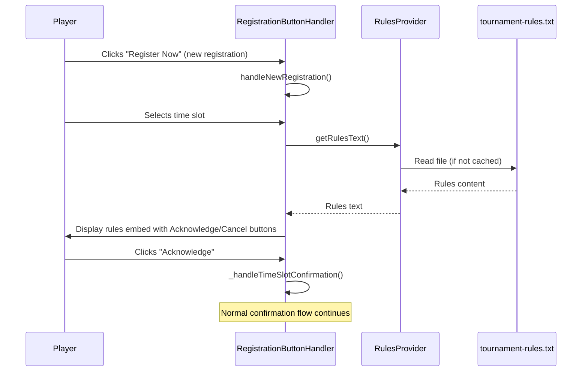

# Design Document: Registration Rules Display

## Overview

This feature adds a tournament rules display step to the new registration flow in the Discord bot. After a player selects a time slot during a new registration, the bot shows the tournament rules in a Discord embed before proceeding to the confirmation step. The rules text is loaded from an external file (`bots/data/tournament-rules.txt`) so administrators can update it without code changes.

The rules display is intentionally skipped during time slot changes for already-registered players, since they have already seen the rules during their initial registration.

## Architecture

The feature integrates into the existing `RegistrationButtonHandler` flow with minimal changes:



For time slot changes, the flow goes directly from slot selection to registration without the rules step — no changes needed to `handleTimeSlotChange`.

## Components and Interfaces

### 1. RulesProvider (`bots/src/services/RulesProvider.js`)

A simple module responsible for loading and caching the rules text from the external file.

```javascript
/**
 * Loads tournament rules text from the external file.
 * Caches the content after first read.
 * @returns {Promise<string>} The rules text content
 * @throws {Error} If the file cannot be read
 */
async function getRulesText() { }

/**
 * Clears the cached rules text, forcing a reload on next call.
 */
function clearCache() { }
```

- Reads from `bots/data/tournament-rules.txt`
- Caches the file content in memory after first read (rules don't change at runtime)
- Exposes `clearCache()` for testing and manual refresh
- On file read failure, throws an error that the caller handles

### 2. Rules Display Step in RegistrationButtonHandler

A new private method `_handleRulesDisplay` is added to `RegistrationButtonHandler`. It is called from the `handleNewRegistration` collector after the player selects a time slot, before `_handleTimeSlotConfirmation`.

```javascript
/**
 * Shows tournament rules to the player and waits for acknowledgment.
 * @param {ButtonInteraction} interaction - The original deferred interaction
 * @param {StringSelectMenuInteraction} selectInteraction - The time slot selection interaction
 * @param {Object} tournamentData - Current tournament data
 * @param {Array} formattedSlots - Formatted time slot options
 * @param {string} timezone - Player's timezone
 */
async _handleRulesDisplay(interaction, selectInteraction, tournamentData, formattedSlots, timezone) { }
```

Flow within `_handleRulesDisplay`:
1. Call `RulesProvider.getRulesText()` to get the rules content
2. Build a Discord embed with the rules text
3. Add "I Acknowledge the Rules" (Success style) and "Cancel" (Danger style) buttons
4. On acknowledge → call `_handleTimeSlotConfirmation` with the original parameters
5. On cancel → show cancellation message
6. On timeout (5 minutes) → show timeout message
7. If rules file fails to load → log error, show fallback message, and still proceed to confirmation

### 3. Tournament Rules File (`bots/data/tournament-rules.txt`)

A plain text file containing the rules. The bot reads this file as-is and places the content into a Discord embed description. Discord markdown formatting (bold, underline, bullet points) is preserved since Discord embeds support markdown.

## Data Models

No new database tables or API changes are required. The only new data artifact is the rules text file.

### Tournament Rules File Format

```
# Rules of The Weekly
* Username Consistency: Scorecard and Discord name must match
* Start on Time: strive for :00 minutes on the scorecard ! (show up 3 minutes early). 
* No Solo or Proxy Play Allowed
...
```

The file is read as a UTF-8 string. No parsing is needed — the content is placed directly into the embed description field.

### Rules Embed Structure

```javascript
{
  color: 0x0099FF,
  title: '📜 Tournament Rules',
  description: '<content from tournament-rules.txt>',
  footer: { text: 'Please read the rules carefully before proceeding.' }
}
```

### Button Components

| Button | Custom ID | Style | Emoji |
|--------|-----------|-------|-------|
| I Acknowledge the Rules | `reg_rules_acknowledge` | Success (green) | ✅ |
| Cancel | `reg_rules_cancel` | Danger (red) | ❌ |


## Correctness Properties

*A property is a characteristic or behavior that should hold true across all valid executions of a system — essentially, a formal statement about what the system should do. Properties serve as the bridge between human-readable specifications and machine-verifiable correctness guarantees.*

### Property 1: Rules file content round trip

*For any* valid UTF-8 text string written to the rules file, calling `getRulesText()` should return that exact string (trimmed of leading/trailing whitespace to match file read behavior).

**Validates: Requirements 2.1**

This is a classic round-trip property. We write arbitrary text to the rules file path, then call `getRulesText()` (after clearing the cache), and verify the returned content matches. This ensures the file loading mechanism faithfully preserves whatever content administrators put in the file.

### Property 2: Rules text preservation in embed

*For any* non-empty rules text string, the Discord embed built by the rules display step should contain the rules text in its description field, preserving the original content exactly.

**Validates: Requirements 2.3, 3.2**

This property consolidates two acceptance criteria that both require content preservation. If the embed description equals the input text, then bullet points, line breaks, and all other formatting are preserved by definition. We generate random strings containing markdown characters, newlines, and bullet points, build the embed, and verify the description matches.

## Error Handling

| Scenario | Handling | User Impact |
|----------|----------|-------------|
| Rules file missing or unreadable | `getRulesText()` throws; `_handleRulesDisplay` catches, logs error, shows fallback message, and proceeds to confirmation | Player sees "Rules could not be loaded" but can still register |
| Acknowledge/Cancel button interaction fails | Catch error, log, show generic error message | Player asked to try again |
| Rules display collector times out (5 min) | Show timeout message, stop collector | Player clicks "Register Now" again to restart |
| Rules text exceeds Discord embed limit (4096 chars) | Truncate with "..." and add note to visit website | Player sees truncated rules with link to full version |

The key design decision is that a rules file failure should not block registration. The rules are informational — if they can't be loaded, the player should still be able to register, with a note that rules couldn't be displayed.

## Testing Strategy

### Unit Tests (Vitest)

Unit tests cover specific examples and edge cases:

- **RulesProvider**: File exists and returns content, file missing throws error, cache works (second call doesn't re-read file), `clearCache()` forces re-read
- **_handleRulesDisplay**: Embed contains title, description, and footer; acknowledge button proceeds to confirmation; cancel button cancels registration; timeout shows timeout message
- **Flow integration**: `handleNewRegistration` calls `_handleRulesDisplay` after time slot selection; `handleTimeSlotChange` does not call `_handleRulesDisplay`
- **Fallback behavior**: When rules file fails to load, registration still proceeds with fallback message

### Property-Based Tests (fast-check + Vitest)

Property tests use the `fast-check` library (already a project dependency) with Vitest.

- **Property 1**: Rules file round trip — generate arbitrary text, write to file, load via `getRulesText()`, assert equality. Min 100 iterations.
  - Tag: `Feature: registration-rules-display, Property 1: Rules file content round trip`
- **Property 2**: Rules text preservation in embed — generate arbitrary markdown-like strings, build the rules embed, assert description matches input. Min 100 iterations.
  - Tag: `Feature: registration-rules-display, Property 2: Rules text preservation in embed`

Each correctness property is implemented by a single property-based test. Tests are placed in `bots/src/tests/RulesProvider.property.test.js`.
