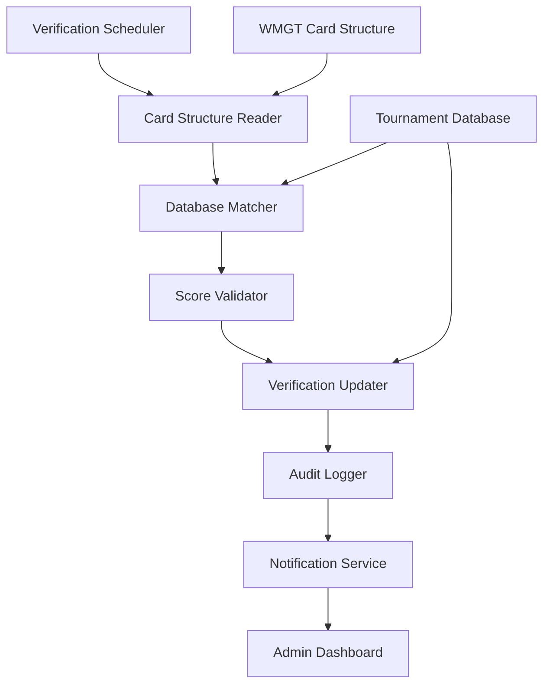

# Design Document

## Overview

The Scorecard Verification Automation system will automatically verify tournament scorecards by comparing data from the WMGT card structure repository against submitted rounds in the main tournament database. The system operates at the room level, matching players and verifying hole-by-hole scores for both courses played in each tournament room. When all scores match perfectly, the system automatically updates the verification status in the wmg_tournament_players table.

## Architecture

The system follows a batch processing architecture with the following key components:



### Processing Flow

1. **Trigger**: Verification runs on a scheduled basis or can be manually triggered
2. **Data Retrieval**: System reads scorecard data from the external card structure repository
3. **Room Matching**: Identifies tournament rooms that have corresponding card data
4. **Player Matching**: Matches players between card structure and tournament database
5. **Score Validation**: Compares hole-by-hole scores and course totals
6. **Verification Update**: Updates verification status for matching scorecards
7. **Reporting**: Logs results and generates reports for manual review cases

## Components and Interfaces

### 1. Card Structure Interface

**Purpose**: Connects to and reads data from the external WMGT card structure repository

**Key Methods**:
- `connect_to_card_structure()`: Establishes connection to external repository
- `get_card_runs_for_verification()`: Retrieves unprocessed card runs
- `get_card_players(run_id)`: Gets player data for a specific run
- `get_card_scores(run_id, player)`: Gets hole-by-hole scores for a player

**Data Sources**:
- `wmg_card_runs`: Contains run metadata (course, server, channel info)
- `wmg_card_players`: Contains player totals and relative scores
- `wmg_card_scores`: Contains hole-by-hole stroke data

### 2. Tournament Database Interface

**Purpose**: Queries and updates the main tournament database

**Key Methods**:
- `get_tournament_sessions_for_verification()`: Gets sessions needing verification
- `get_tournament_players(session_id, room_no)`: Gets players in a specific room
- `get_player_rounds(player_id, session_id)`: Gets submitted rounds for a player
- `update_verification_status(player_id, session_id, status)`: Updates verification flags

**Data Sources**:
- `wmg_tournament_sessions`: Tournament session metadata
- `wmg_tournament_players`: Player registration and verification status
- `wmg_rounds`: Individual round data with hole-by-hole scores

### 3. Verification Engine

**Purpose**: Core logic for matching and validating scorecards

**Key Methods**:
- `verify_room(session_id, room_no)`: Main verification method for a room
- `match_players(card_players, tournament_players)`: Matches players between systems
- `validate_scores(card_scores, round_scores)`: Compares hole-by-hole scores
- `calculate_course_totals(scores)`: Validates course total calculations

**Matching Logic**:
- Primary match: Player account/name exact match
- Secondary match: Fuzzy matching on player names
- Validation: Ensure same number of players in both systems

### 4. Audit and Logging Service

**Purpose**: Comprehensive logging and audit trail maintenance

**Key Methods**:
- `log_verification_attempt(session_id, room_no, result)`: Logs verification attempts
- `log_mismatch_details(player_id, hole_num, expected, actual)`: Logs score discrepancies
- Uses `logger` for all logging.
- `generate_verification_report(session_id)`: Creates verification summary reports

## Data Models

### Verification Result Model

```sql
CREATE TABLE wmg_verification_log (
    id NUMBER GENERATED BY DEFAULT AS IDENTITY PRIMARY KEY,
    tournament_session_id NUMBER NOT NULL,
    room_no NUMBER,
    player_id NUMBER,
    verification_type VARCHAR2(20), -- 'AUTO_SUCCESS', 'AUTO_FAILED', 'MANUAL_REVIEW'
    card_run_id NUMBER,
    mismatch_details CLOB, -- JSON with specific mismatches
    verified_on TIMESTAMP WITH LOCAL TIME ZONE DEFAULT CURRENT_TIMESTAMP,
    verified_by VARCHAR2(60) DEFAULT 'SYSTEM'
);
```

### Score Comparison Model

```sql
-- Temporary structure for comparison processing
TYPE score_comparison_rec IS RECORD (
    player_id NUMBER,
    course_id NUMBER,
    room_no NUMBER,
    hole_num NUMBER,
    card_score NUMBER,
    round_score NUMBER,
    match_flag VARCHAR2(1)
);

TYPE score_comparison_tbl IS TABLE OF score_comparison_rec;
```

## Error Handling

### Data Inconsistencies

- **Missing Players**: Flag for manual review, log specific missing players
- **Extra Players**: Flag for manual review, identify unexpected players
- **Score Mismatches**: Log detailed comparison, flag specific holes with issues
- **Total Calculation Errors**: Validate arithmetic, flag calculation discrepancies

### Processing Errors

- **Partial Room Data**: Skip room if incomplete data, log reason

## Testing Strategy

### Unit Testing

1. **Card Structure Interface Tests**
   - Mock external repository connections
   - Test data parsing and transformation

2. **Verification Engine Tests**
   - Test player matching algorithms
   - Validate score comparison logic
   - Test edge cases (missing scores, extra holes)

### Integration Testing

1. **End-to-End Verification**
   - Test complete verification workflow
   - Validate data consistency between systems
   - Test rollback scenarios for failed verifications

2. **Performance Testing**
   - Test with realistic tournament data volumes
   - Measure processing time for full tournament sessions
   - Validate memory usage patterns

3. **Error Scenario Testing**
   - Test behavior when card structure is unavailable
   - Validate handling of corrupted or incomplete data
   - Test recovery from partial processing failures

### Data Validation Testing

1. **Score Accuracy Tests**
   - Verify hole-by-hole score matching
   - Test course total calculations
   - Validate par calculations and relative scoring

2. **Player Matching Tests**
   - Test exact name matches
   - Validate fuzzy matching algorithms
   - Test handling of duplicate or similar names

## Security Considerations

### Data Integrity

- **Transaction Management**: Ensure atomic updates to verification status
- **Rollback Capability**: Ability to reverse verification decisions if needed
- **Data Validation**: Comprehensive validation before updating verification flags

## Performance Considerations

No an issue.