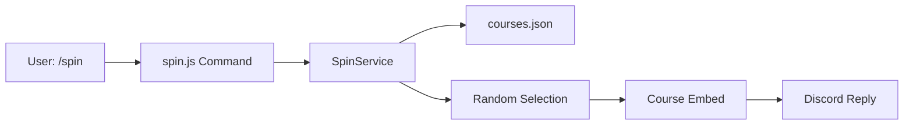

# Design Document: Spin Command

## Overview

The Spin Command adds a `/spin` slash command to the WMGT Discord bot that randomly selects a Walkabout Mini Golf course. Users can optionally filter by difficulty (Easy or Hard). Course data is loaded from a static JSON file (`bots/data/courses.json`) at startup and cached in memory. The selected course is displayed as a rich Discord embed with the course image.

This is a lightweight, self-contained feature with no database or API dependencies — all data comes from a local JSON file.

## Architecture



The feature follows the existing bot architecture:
- **Command layer** (`bots/src/commands/spin.js`): Handles Discord interaction, parses the optional difficulty parameter, delegates to the service
- **Service layer** (`bots/src/services/SpinService.js`): Loads course data, filters by difficulty, performs random selection, builds the embed
- **Data layer** (`bots/data/courses.json`): Static JSON file with all 74 courses

## Components and Interfaces

### 1. Course Data File (`bots/data/courses.json`)

A JSON array of course objects. Each object has:

```json
[
  { "code": "20E", "name": "20,000 Leagues Under The Sea", "difficulty": "Easy" },
  { "code": "20H", "name": "20,000 Leagues Under The Sea", "difficulty": "Hard" },
  ...
]
```

### 2. SpinService (`bots/src/services/SpinService.js`)

Responsible for loading, filtering, and selecting courses.

```js
class SpinService {
  constructor() { this.courses = null; }

  // Loads and caches courses from JSON file
  async loadCourses(): Course[]

  // Filters courses by difficulty (or returns all if null)
  filterCourses(courses: Course[], difficulty: string | null): Course[]

  // Selects a random course from the provided array
  selectRandom(courses: Course[]): Course

  // Builds a Discord EmbedBuilder for the selected course
  buildEmbed(course: Course): EmbedBuilder
}
```

### 3. Spin Command (`bots/src/commands/spin.js`)

Follows the existing command pattern (see `votes.js`):

```js
export default {
  data: new SlashCommandBuilder()
    .setName('spin')
    .setDescription('Randomly select a Walkabout Mini Golf course')
    .addStringOption(option =>
      option.setName('difficulty')
        .setDescription('Filter by difficulty')
        .setRequired(false)
        .addChoices(
          { name: 'Easy', value: 'Easy' },
          { name: 'Hard', value: 'Hard' }
        )),

  async execute(interaction) { ... }
}
```

## Data Models

### Course Object

| Field      | Type   | Description                          | Example                              |
|------------|--------|--------------------------------------|--------------------------------------|
| code       | string | Short code identifier                | `"20E"`                              |
| name       | string | Full course name                     | `"20,000 Leagues Under The Sea"`     |
| difficulty | string | `"Easy"` or `"Hard"`                 | `"Easy"`                             |

### Course Image URL

Constructed at display time, not stored in the data file:

```
https://objectstorage.us-ashburn-1.oraclecloud.com/n/idw1nygcxpvm/b/wmgt-assets/o/{CODE}_FULL.jpg
```

### Embed Colors

| Difficulty | Color   | Hex        |
|------------|---------|------------|
| Easy       | Green   | `0x57F287`  |
| Hard       | Blue    | `0x5865F2`  |


## Correctness Properties

*A property is a characteristic or behavior that should hold true across all valid executions of a system — essentially, a formal statement about what the system should do. Properties serve as the bridge between human-readable specifications and machine-verifiable correctness guarantees.*

### Property 1: Course data structure validity

*For any* entry in the parsed courses array, the entry shall have exactly three fields — `code` (non-empty string), `name` (non-empty string), and `difficulty` (either `"Easy"` or `"Hard"`) — with no missing or extra fields.

**Validates: Requirements 1.1**

### Property 2: Selection membership

*For any* non-empty array of courses, calling `selectRandom` shall return a course that is a member of that array.

**Validates: Requirements 2.1, 2.4**

### Property 3: Filter correctness

*For any* array of courses containing both Easy and Hard entries, and *for any* difficulty filter value (`"Easy"` or `"Hard"`), filtering then selecting shall produce a course whose difficulty matches the filter.

**Validates: Requirements 2.2, 2.3**

### Property 4: Embed correctness

*For any* course object, the embed built by `buildEmbed` shall contain the course name, short code, difficulty label, the correct color for the difficulty (green for Easy, blue for Hard), and an image URL containing the course code.

**Validates: Requirements 3.1, 3.2, 3.3**

## Error Handling

| Scenario | Handling |
|---|---|
| `courses.json` missing or malformed | `loadCourses` throws an error; command catches it and replies with an error embed via `ErrorHandler` |
| Filtered list is empty | `filterCourses` returns empty array; command detects this and replies with a "no courses match" message |
| Unexpected error during execution | Caught by top-level try/catch in `execute`; logged via `Logger`, replied via `ErrorHandler.handleInteractionError` |

Error handling follows the existing bot pattern: `deferReply()` first, then `editReply()` with error embeds on failure. The `ErrorHandler` utility is reused for consistent error presentation.

## Testing Strategy

### Property-Based Tests (Vitest + fast-check)

Property-based tests use the `fast-check` library with Vitest. Each test runs a minimum of 100 iterations.

| Test | Property | Validates |
|------|----------|-----------|
| All course entries have valid structure | Property 1 | Req 1.1 |
| selectRandom returns a member of input | Property 2 | Req 2.1, 2.4 |
| Filter + select respects difficulty | Property 3 | Req 2.2, 2.3 |
| buildEmbed contains all course info | Property 4 | Req 3.1, 3.2, 3.3 |

Each test is tagged with: `Feature: spin-command, Property N: <title>`

### Unit Tests (Vitest)

- Verify `loadCourses` returns 74 courses with correct Easy/Hard split (Req 1.2)
- Verify command registration metadata: name is `"spin"`, has optional difficulty option with correct choices (Req 4.1, 4.2, 4.3)
- Verify error handling when `courses.json` is missing (Req 5.1)
- Verify behavior when filter produces empty list (Req 5.2)
- Verify generic error handling in execute (Req 5.3)

### Test File Location

`bots/src/tests/spin.test.js` — follows existing test file conventions in the bot project.
